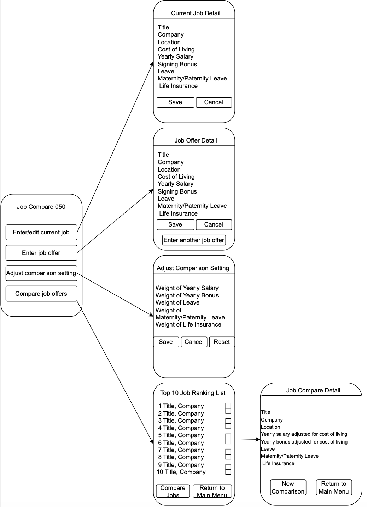

# Design Document

| Version | Date       | Description                                                                                                                                                             |
| ------- |------------|-------------------------------------------------------------------------------------------------------------------------------------------------------------------------|
| 1.0     | 2023-06-25 | Initial Version                                                                                                                                                         |
| 1.1     | 2023-07-03 | 1. Update constraints section  2. Update class diagram 4. Update component diagram and add description to component diagram 3. Remove template descriptions |

## 1 Design Considerations

### 1.1 Assumptions

*1. This will be a single-user application. 2. There is no caching required across devices.  3. This application will be used only on Android OS.  4. Product Owner is operating outside the team.  5. Due to limited time constraints only unit testing and user acceptance testing will be performed. 6. There will be only one environment that will be used both for testing and final delivery to production.*

### 1.2 Constraints

*The backend DB for this app should utilize an existing solution for Android, specifically SQLLite, without using external could service.  This app will support upto 1 current job detail and 10 job offer details only*

### 1.3 System Environment

*This system is being for built for mobile platform only and specifically Android OS only*

## 2 Architectural Design

### 2.1 Component Diagram

The component diagram showcases the various components, their relationships, and the backend database interactions. At the left of the diagram is the "MainMenu" Component, which serves as the entry point for the application. It provides a high-level view of the available features of this application.
At the center of the diagram include multiple sub-screen components including "Current Job", "Job Offer Catalog", "Job Comparison" and "Comparison Setting". The "Current Job" sub-screen enables the user to enter or edit current job details while the "Job Offer Catalog" sub-screen enables the user to enter job offers.
The "Comparison Setting" screen provides the feature of adjusting comparison settings. And the "Job Comparison" enables the comparison between jobs. At the right of the diagram is the database connection. There are two main tables include "Job Details" and "Comparison Setting".
To distinguish between a current job and a job offer, a field "job type" is added to job detail table.
### 2.2 Deployment Diagram

If the job comparison application is online, the deployment diagram shown above illustrates how the different components of the job comparison application are deployed on the actual hardware device. The user interface resides on the user's device and communicates with the server over the Internet. The server hosts job comparison applications and interacts with the database where jobs are stored. If the application is not an online application, there will be no application server and all data will be stored locally. Then for this android application, the Diagram is unnecessary because all the components are contained in the phone.

## 3 Low-Level Design

### 3.1 Class Diagram

## 4 User Interface Design

Here is a basic graphical mockup of the user interface for the job comparison app:

This mockup first represents the main menu of the app, where the user can choose to enter/edit current job, enter job offer, adjust comparison settings, and compare job offers. After clicking each key, the corresponding page will appear. For example, if the user clicks the "Compare job offers" button, the user will be shown a page of a list of job offers, displayed as Title and Company, ranked from best to worst. And then, the user can select two jobs to compare and trigger the comparison. He/She can see a table comparing the two jobs, displaying, for each job: Title, Company, Location, Yearly salary adjusted for cost of living, Yearly bonus adjusted for cost of living, Leave, Maternity/Paternity Leave, and Life Insurance. In addition, the user can choose to perform another comparison or go back to the main menu.

## 5 Supplementary requirements
Following are non-functional requirements/attributes of the system to be built

### 5.1 Usability:

This system needs to support only a single-user. So handling multiple and/or concurrent requests from multiple users is out of scope.

### 5.2 Reliability:

The system should be always up whenever the User chooses to use it to either add new job offers or compare existing jobs already entered in the system

### 5.3 Performance:

The system should respond in less than 8 secs for any action performed by the user

### 5.4 Maintenance

The system should display relevant error messages with error code to help guide the User to report on what went wrong so it could be identified and rectified by development team
