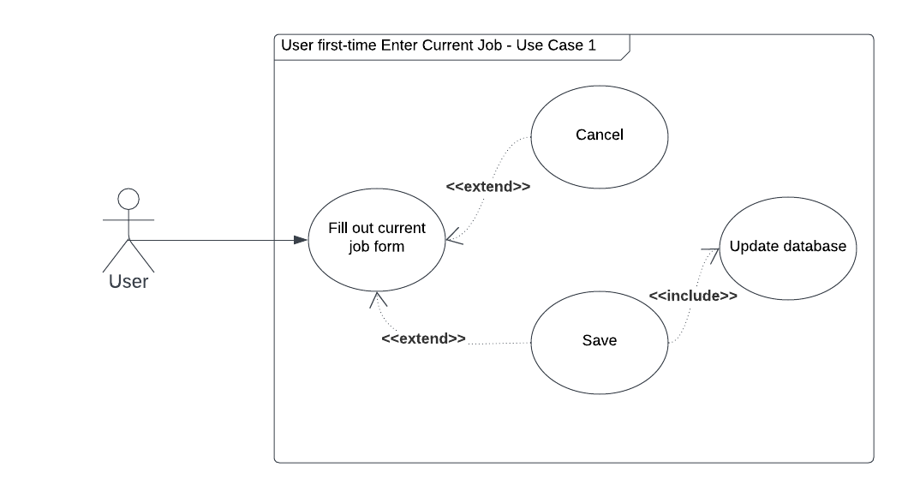
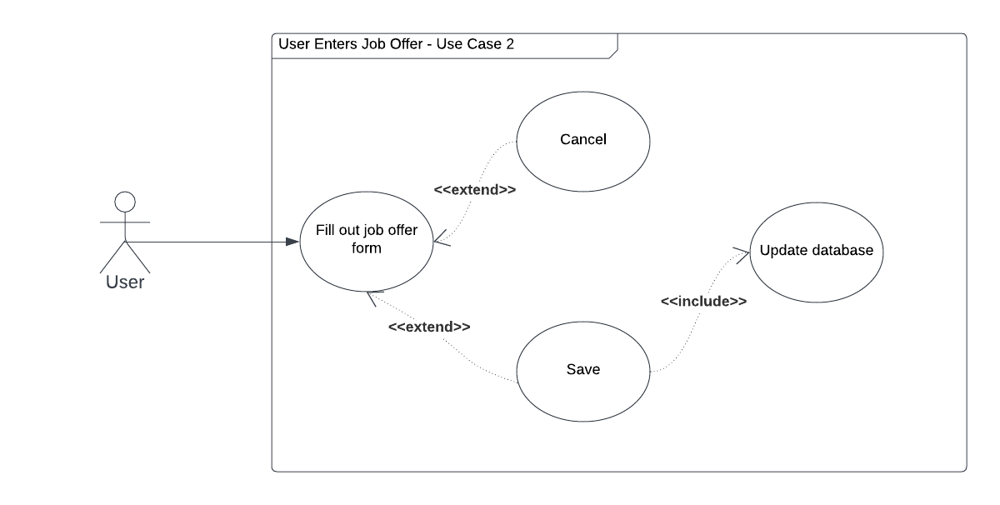
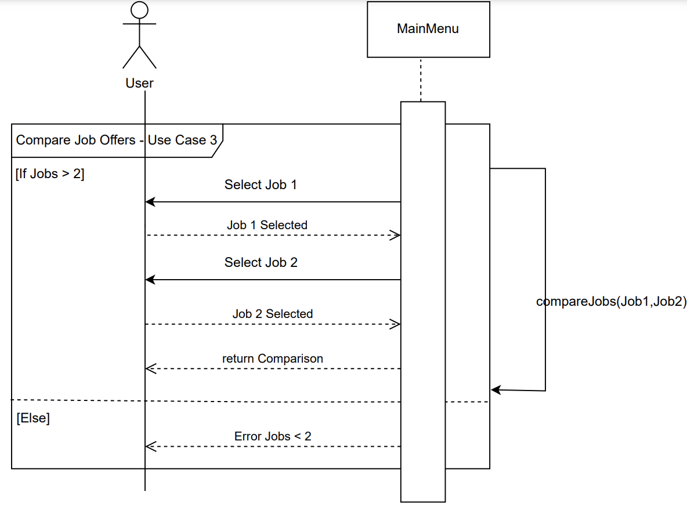
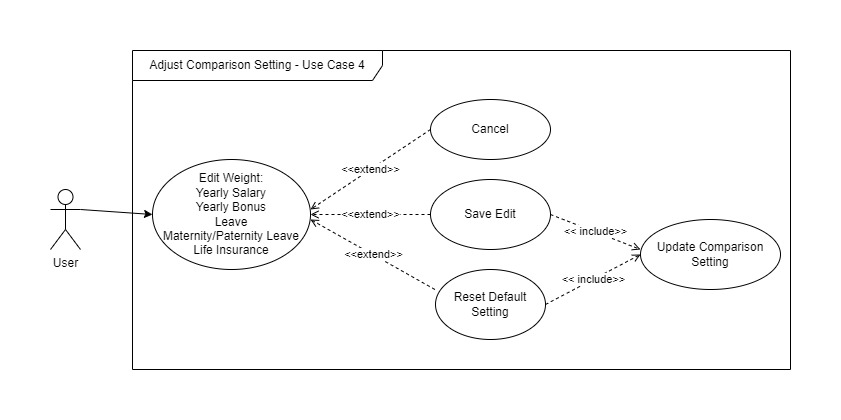

## 1 Use Case Diagram

## 1.1 Enter Current Job

## 1.2 Enter Job Offers

## 1.3 Compare Job Offers

## 1.4 Use Case - Adjust the Comparison Setting

## 2 Use Case Descriptions

### 2.1 Use Case - Enter Current Job
- Requirements: The user enters his/her current job detail for the first time

- Pre-conditions: The user can access enter current job from main menu

- Post-conditions: After entering the current job detail, the data is saved in database

- Scenarios:

- Normal Scenario - User saves the current job then returns to the main menu

  - The user selects enter or edit current job details from the main menu

  - The user is given a blank enter job details interface to enter all the information about their current employment because it is their first time entering job details

  - The user fills in the required information, such as title, company, location, cost of living, yearly salary, yearly bonus, leave, maternity/paternity leave, and life insurance

  - Ther user saves the enter information

  - The user returns to the main menu

- Alternative Scenario - User cancels and exits to the main menu

  - The user selects enter or edit current job details from the main menu

  - The user is given a blank enter job details interface to enter all the information about their current employment because it is their first-time entering job details.

  - The user can choose to fill in the required information, such as title, company, location, cost of living, yearly salary, yearly bonus, leave, maternity/paternity leave, and life insurance or not.

  - Ther user hits cancel option.

  - The user returns to the main menu.

### 2.2 Use Case - Enter Job Offer
- Requirements: The user enters his/her job offer details

- Pre-conditions: The user can access enter job offer from main menu

- Post-conditions: After entering the job offer detail, the data is saved into the database.

- Scenarios:

- Normal Scenario - User saves the job offer then directs to job offer catalog

    - The user selects enter job offer catalog from the main menu

    - The user selects adding job offer option

    - The user is given a blank enter job offer details interface to enter all necessary information

    - The user fills in the required information,

    - Ther user saves the enter information.

    - The user would be redirected to the job offer catalog and presented with 3 options. One is adding another offer, two is return to the main menu, or compare the offer (if saved) with the current job details (if present)

- Alternative Scenario - User cancels and exits to the main menu

    - The user selects enter job offer from the main menu

    - The user is given a blank enter job offer details interface to enter all necessary information

    - The user can choose to fill in the required information or not

    - The user hits cancel option

    - The user returns to the main menu

### 2.3 Use Case - Compare Job Offers
- Requirements:  The use case must allow the user to view a list of job offers, select two jobs to compare, view a comparison table of the selected jobs, and then either perform another comparison or return to the main menu.

- Pre-conditions: The user must have at least two job offers to compare. The user must be on the job offers list page.

- Post-conditions: The user has viewed a comparison of two job offers. The user has the option to perform another comparison or return to the main menu.

- Scenarios:

- Normal Scenario:

  - The user views the list of job offers.

  - The user selects two job offers to compare.

  - The system displays a comparison table of the two selected job offers.

  - The user selects one of the jobs.

- Alternative Scenario:
  - The user decides to perform another comparison or return to the main menu.

  - If less than two jobs are present, the user will be shown an error message.

### 2.4 Use Case - Adjust the Comparison Setting
- Requirements: Use can adjust the comparison setting.
- Pre-conditions: User first enters the application or returns to the main menu after other operations.
- Post-conditions: User must return to main menu after the use case is done.
- Scenarios:
- User click on adjust the comparison setting button on the main menu.
- The last save comparison setting for Yearly Salary, Yearly bonus, Leave, Maternity/Paternity Leave and Life Insurance will be presented. And User should be able to update any of the weights.
- Three buttons will be presented: cancel, save, and reset default setting.
- Normal Scenario
  - User click on "Save" button, any changes made on the screen will be saved to the comparison setting and return to main menu.
- Alternative Scenario
  - User click on "Cancel" button, it will return to main menu and no updates made to comparison setting.
  - User click on "Reset" button, all weights are updated to initial value "1" and saved to the comparison setting and return to main menu.
