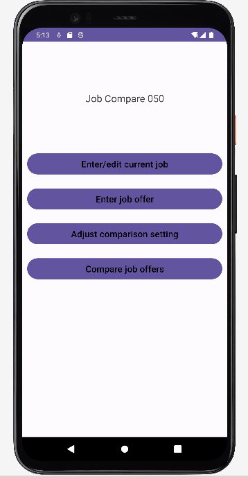
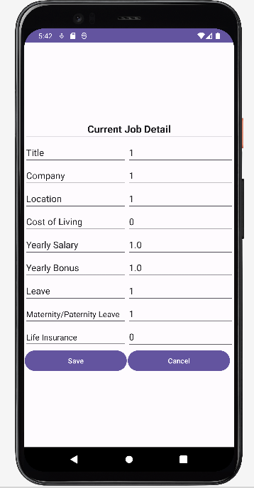
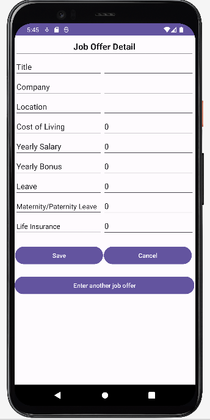
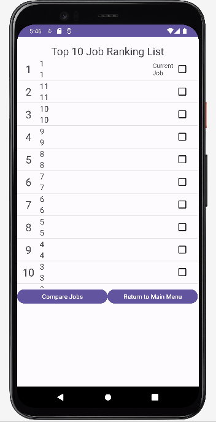
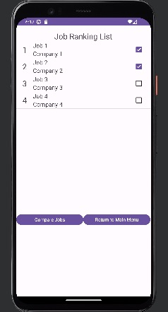
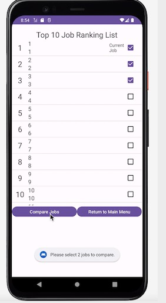
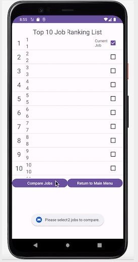
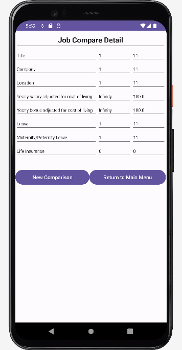
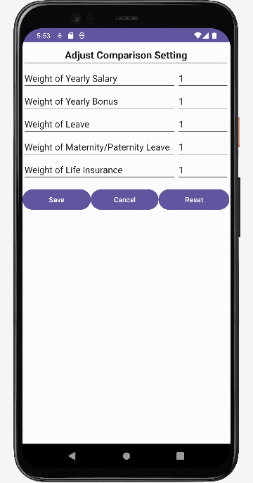

# Job Compare CS6300 User Manual

## Table of contents
1. [Introduction](#introduction)
2. [Installation and Setup](#install)
3. [User Interface](#ui)
4. [Features and Functionality](#feature)
   1. [Enter Current Job](#enterCurrentJob)
   2. [Enter Job Offer](#enterJobOffer)
   3. [Compare Jobs](#compareJobs)
   4. [Adjust Comparison Setting](#comparisonSetting)
5. [Troubleshooting and FAQs](#faq)
6. [Update and Support](#update)

## Introduction 

*Job Compare CS6300 is an app developed to help people compare and evaluate their current jobs and other job offers, which is greatly beneficial for their careers. This user manual will help you navigate the features and functions of the app, helping you achieve better career goals.*

## Installation and Setup 

*The user can install Job Compare 6300 through the app store on their device. When a user searches Job Compare 6300 in the search box, the app should be at the top of the search result. By clicking the result, the user will be directed to the app information page, where an install button should be shown. The user can tap the install icon, and the installation will start automatically. After the installation is complete, tap the app icon, and the app will be launched.*

## Features and Functionality 

*When you first enter the Job Compare CS6300 app, you will be presented with the following screen with multiple options.*

### Enter Current Job 
*When you first enter the Job Compare CS6300, you should enter your current job (if present), which helps you have a starting point to compare. Follow these steps:*

   - Select "Enter/Edit current job details" from the main menu

   - Fill in your current job details

   - Tap on the "Save" button once finish

### Enter Job Offer 
*If you find a job offer that interests you, you can enter it in the Job Offer section. Follow these steps:*

   - Select "Enter Job Offers" from the main menu

   - Fill in the job offer interests you

   - Tap on the "Save" button once finish or "Enter another job offer" button to enter another job offer

### Compare Jobs 
*Using Compare Job, you can quickly search for and contrast employment options. You can select the jobs you want to compare from a list of jobs that will be displayed. Follow these steps:*

   - Select "Compare Job Offers" from the main menu

   - A list of top 10 job offers based on the job scores will display as shown below

   

   - Click the check boxes and pick 2 job offers to compare
   
   

   - If choose less or more than 2 job offers, the error message will display as shown below
   
    

   - Tap on the "Compare" button

   - A table of the 2 chosen job offers will show the comparison results

   - Tap on the "New Comparison" button to perform another comparison or the "Return to MainMenu" button to go back to the main menu

### Adjust Comparison Setting 
*Since users have their own preferences on location, salary, bonus, 401(k), etc. We have developed a feature to help them change their preferences for different perspectives. Follow these steps:*

   - Select "Adjust Comparison Setting" from the main menu

   - Enter the number you consider appropriate for each attribute

   - Tap on the "Save" button to update comparison setting

## Troubleshooting and FAQs
*If you run into any issues or problems, you can exit the app and relaunch it or try to update the app within the app store. If the problem continues, contact our customer service department at customersservices@jobcompare.com.*

## Update and Support
*If you want to get the most current update of the app, share your feedback, or get support from us, you can contact our customer service department at customersservices@jobcompare.com.*
